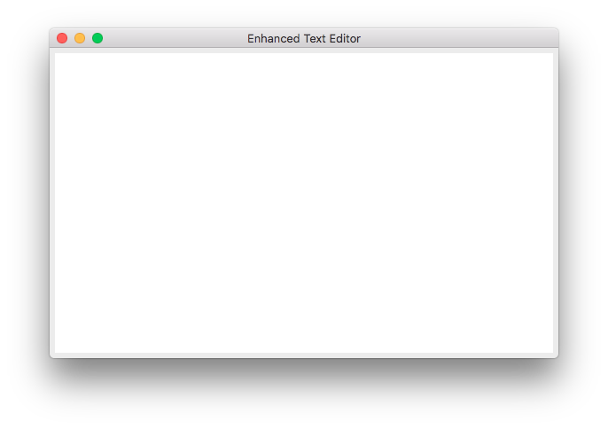
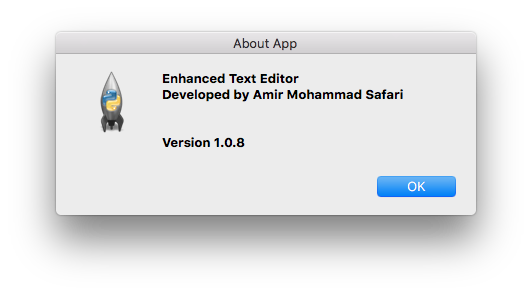
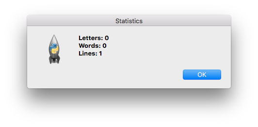
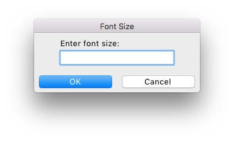
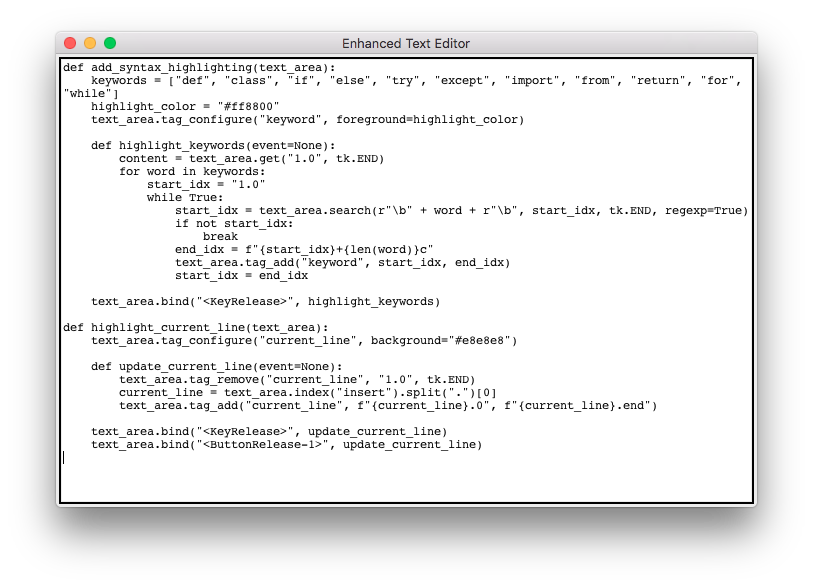
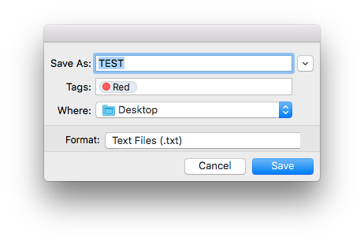

Here's a `README.md` for your Notepad text editor project:

---

# Notepad Text Editor by JARVIS-AI

**Version**: 1.0.0

A simple, lightweight Notepad-style text editor built in Python using Tkinter. This application offers basic text editing functionality in a user-friendly interface.

---

## Features

- **Basic Editing Functions**: Includes essential text editing features like typing, saving, opening, and editing text files.
- **Simple GUI**: Easy-to-use interface, similar to classic Notepad.
- **File Support**: Open and save `.txt` files, allowing for quick editing and note-taking.

---

## Installation

1. **Clone the Repository**:
   ```bash
   git clone https://github.com/username/notepad-text-editor.git
   cd notepad-text-editor
   ```

2. **Install Dependencies**:
   Ensure you have Python 3 and Tkinter installed.

---

## Usage

1. **Run the App**:
   ```bash
   python notepad.py
   ```

2. **Start Editing**:
   - **New**: Clear the editor to start a new document.
   - **Open**: Open an existing `.txt` file for editing.
   - **Save**: Save the current document to a file.
   - **Exit**: Close the application.

---

## Screenshots

  

<hr />



<hr />



<hr />



<hr />



<hr />



---

## Contributing

Contributions are welcome! Feel free to open issues for suggestions or submit pull requests to improve the app.

---

## License

This project is licensed under the MIT License.

---

## Contact

For questions, please reach out via [your email or GitHub profile].

---

Let me know if you want to add more features or customization details!